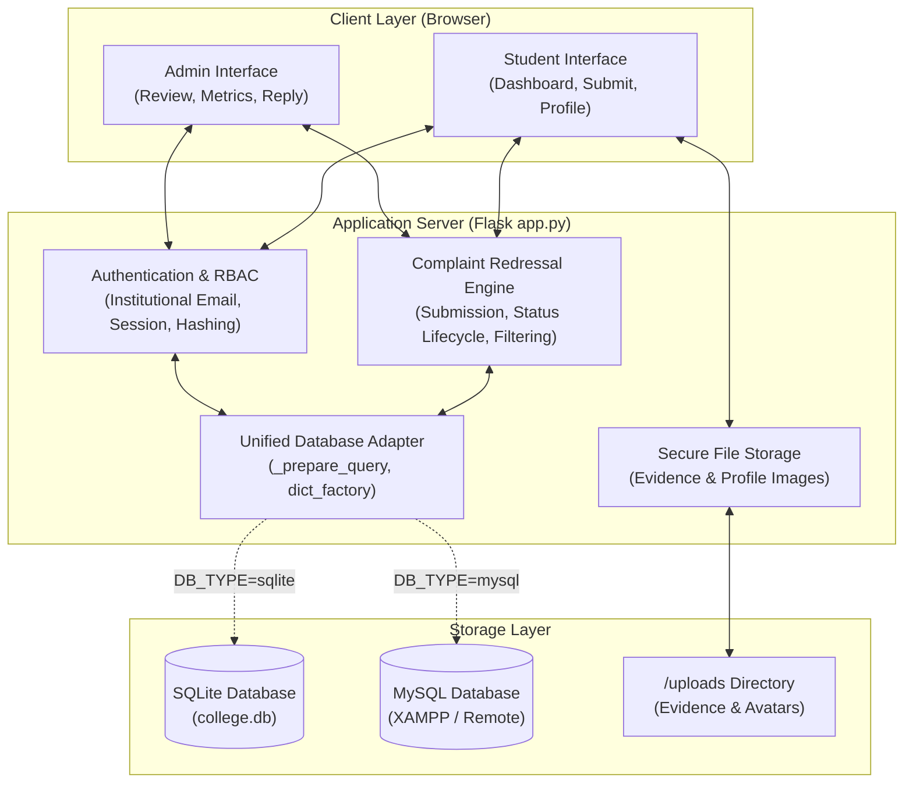
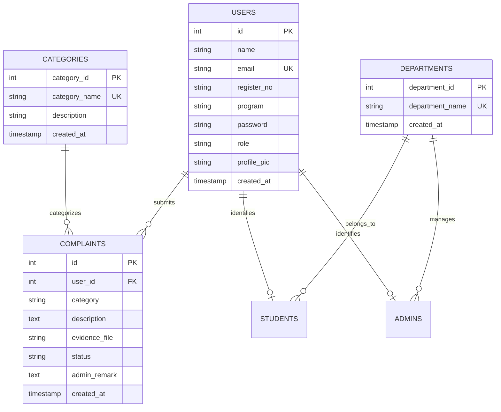
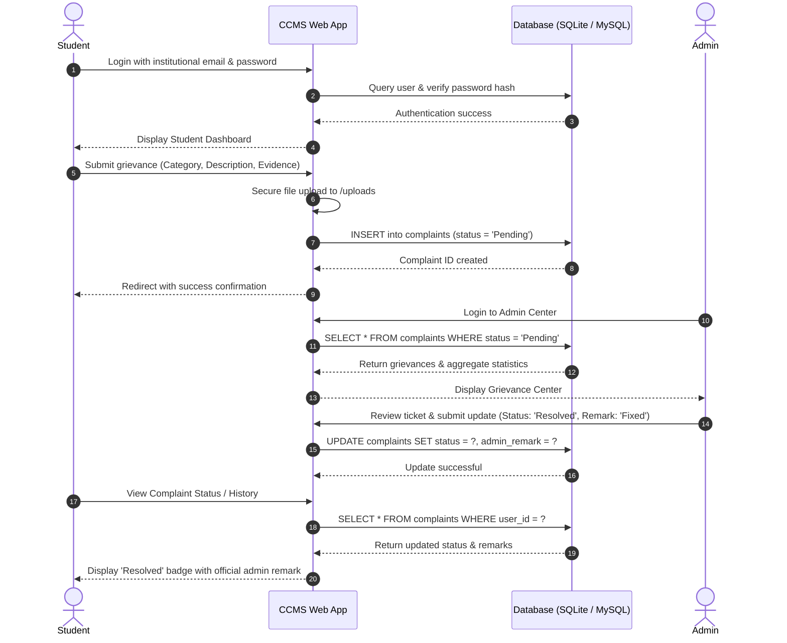

# College Complaint Management System (CCMS)
## Comprehensive Technical & Operational Documentation

---

## 1. Executive Summary & Project Overview

### 1.1 Purpose & Problem Statement
In educational institutions, manual or ad-hoc complaint filing mechanisms (such as suggestion boxes, unorganized emails, or paper forms) often result in:
- Delayed response times and unresolved grievances.
- Lack of accountability and transparent tracking.
- Absence of centralized analytics for college administration to identify recurring infrastructure, transport, hostel, or academic bottlenecks.

The **College Complaint Management System (CCMS)** is an institutional web platform developed for Kristu Jayanti College students and administrators. It provides a standardized, auditable, and transparent complaint redressal workflow.

### 1.2 Core Objectives
- **Secure Self-Service for Students**: Lodge grievances under specific domains with photographic/documentary evidence.
- **Real-Time Lifecycle Tracking**: Monitor resolution stages (`Pending`, `In Progress`, `Resolved`).
- **Centralized Administrative Redressal**: Empower authorized staff to review, update status, and attach official remarks.
- **Portability & Zero Friction**: Native dual-database architecture offering standalone operation with embedded **SQLite** (no external server required) and enterprise scalability via **MySQL**.

---

## 2. System Architecture

### 2.1 Architectural Overview
CCMS follows a modular MVC-like pattern implemented using **Python Flask**:
- **Presentation Layer**: HTML5, CSS3 with Glassmorphism UI, Bootstrap 5.3, FontAwesome, and SweetAlert2.
- **Application / Controller Layer**: Flask application runtime (`app.py`), route controllers, session decorators, request validators, and upload processors.
- **Database Abstraction Layer**: Unified database interface seamlessly operating on either **SQLite** (embedded `college.db`) or **MySQL** (via `mysql-connector-python`).



---

## 3. Database Schema & Data Modeling

### 3.1 Entity-Relationship (ER) Diagram



### 3.2 Data Dictionary

#### Table: `users`
| Column | Type | Constraints | Description |
|---|---|---|---|
| `id` | INTEGER | PRIMARY KEY, AUTO_INCREMENT | Unique user identifier |
| `name` | VARCHAR(150) | NOT NULL | Full name of the user |
| `email` | VARCHAR(255) | NOT NULL, UNIQUE | Institutional email (`@kristujayanti.com`) |
| `register_no` | VARCHAR(80) | DEFAULT '' | College registration / roll number (students) |
| `program` | VARCHAR(100) | DEFAULT '' | Academic course / degree (e.g., B.Tech, BCA) |
| `password` | VARCHAR(255) | NOT NULL | Secure salted password hash (Werkzeug) |
| `role` | VARCHAR(20) | DEFAULT 'student' | Access role: `'student'` or `'admin'` |
| `profile_pic` | VARCHAR(255) | DEFAULT '' | Saved filename of the avatar in `/uploads` |
| `created_at` | TIMESTAMP | DEFAULT CURRENT_TIMESTAMP | Account creation timestamp |

#### Table: `complaints`
| Column | Type | Constraints | Description |
|---|---|---|---|
| `id` | INTEGER | PRIMARY KEY, AUTO_INCREMENT | Unique complaint ticket number |
| `user_id` | INTEGER | NOT NULL, FOREIGN KEY -> `users(id)` | ID of the student who lodged the complaint |
| `category` | VARCHAR(80) | NOT NULL | Category (`Academic`, `Hostel`, `Transport`, etc.) |
| `description` | TEXT | NOT NULL | Detailed description of the grievance |
| `evidence_file` | VARCHAR(255) | DEFAULT '' | Filename of uploaded evidence |
| `status` | VARCHAR(30) | DEFAULT 'Pending' | Ticket state: `'Pending'`, `'In Progress'`, `'Resolved'` |
| `admin_remark` | TEXT | DEFAULT NULL | Administrative resolution remarks |
| `created_at` | TIMESTAMP | DEFAULT CURRENT_TIMESTAMP | Date and time ticket was lodged |

---

## 4. Grievance Redressal Lifecycle



---

## 5. Security & Data Protection Measures

1. **Strict Institutional Email Whitelisting**:
   - Only emails matching the `@kristujayanti.com` domain are permitted to register and authenticate.
2. **Cryptographic Password Security**:
   - Passwords are encrypted using Werkzeug's modern hash derivation (supporting `scrypt` and `pbkdf2:sha256`), preventing cleartext exposure.
3. **Session Hardening & RBAC**:
   - Signed cookies configured with `SESSION_COOKIE_SAMESITE="Lax"`.
   - Access-controlled endpoints guarded by the custom `@login_required(role)` decorator to enforce strict segregation between Student and Admin privileges.
4. **Injection Prevention**:
   - All database read and write operations use parameterized queries (`?` in SQLite and `%s` in MySQL) eliminating SQL Injection risks.
5. **Secure File Handling**:
   - Uploaded files are sanitized via `werkzeug.utils.secure_filename`.
   - Stored in a restricted `/uploads` directory served solely via explicit Flask route validation.
   - Max file payload capped at `16 MB`.

---

## 6. REST API Specification

| Endpoint | Method | Role | Description |
|---|---|---|---|
| `/api/health` | `GET` | Public | Returns health state, active database engine, and connection status |
| `/api/register` | `POST` | Public | Registers a new student or admin account |
| `/api/login` | `POST` | Public | Authenticates credentials and initiates signed session |
| `/api/logout` | `POST` | Public | Terminates active user session |
| `/api/student/complaints` | `GET` | Student | Retrieves all complaints and stats for current student |
| `/api/student/complaints` | `POST` | Student | Lodges a new complaint with multipart category, description, evidence |
| `/api/admin/complaints` | `GET` | Admin | Fetches administrative complaint roster (optional `?cat=` query filter) |
| `/api/admin/complaints/<id>` | `PATCH` | Admin | Updates grievance status (`Pending`, `In Progress`, `Resolved`) and remark |
| `/uploads/<filename>` | `GET` | Authenticated | Serves uploaded evidence files securely |

### Sample Payload: `/api/health`
```json
{
  "database": "sqlite: college.db",
  "db_engine": "sqlite",
  "status": "ok"
}
```

---

## 7. Operating & Execution Guide

### 7.1 Standalone Mode (Zero XAMPP Required)
The system defaults to embedded **SQLite**, meaning no external database software, XAMPP, Apache, or MySQL is required.

1. **One-Click Execution**:
   - Double-click `run.bat` in the project root directory.
   - The script auto-detects running instances, selects the project virtual environment, starts Flask on port `5001`, and opens your default browser to `http://127.0.0.1:5001`.
2. **Manual PowerShell Execution**:
   ```powershell
   .\.venv\Scripts\Activate.ps1
   python app.py
   ```

### 7.2 MySQL Mode (Optional Enterprise / XAMPP)
If enterprise MySQL is preferred:
1. Start MySQL in XAMPP Control Panel.
2. Update `.env`:
   ```env
   DB_TYPE=mysql
   DB_HOST=127.0.0.1
   DB_PORT=3306
   DB_USER=root
   DB_PASSWORD=
   DB_NAME=college
   ```
3. Import `schema.sql` into MySQL if starting fresh.

### 7.3 Demo Accounts Seeding
To immediately populate test credentials in SQLite:
```powershell
python seed_db.py
```
- **Admin**: `admin@kristujayanti.com` | Password: `Admin@123`
- **Student**: `student@kristujayanti.com` | Password: `Student@123`

---

## 8. Quality Assurance & Automated Testing

The project includes automated regression tests using `pytest` under `tests/test_routes.py`:
- Route accessibility tests for login, registration, and root routes.
- Unauthorized access interception (302/303 redirect enforcement for unauthenticated sessions).
- Template variable interpolation tests for student dashboards, complaints detail, and history logs.

To run the automated suite:
```powershell
python -m pytest tests
```
